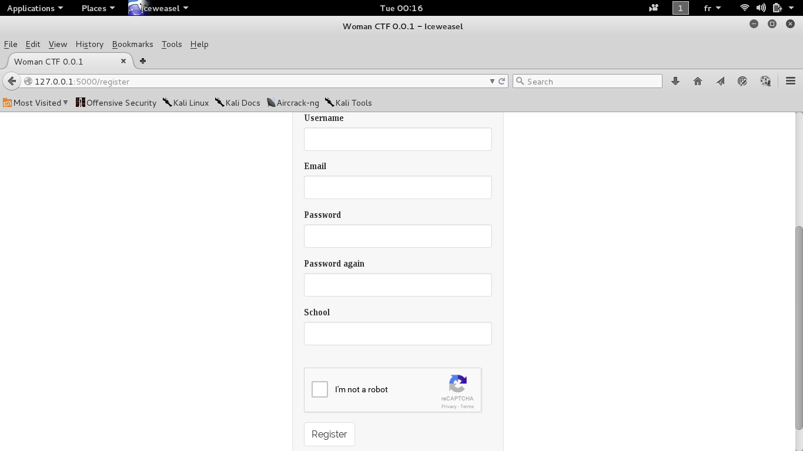
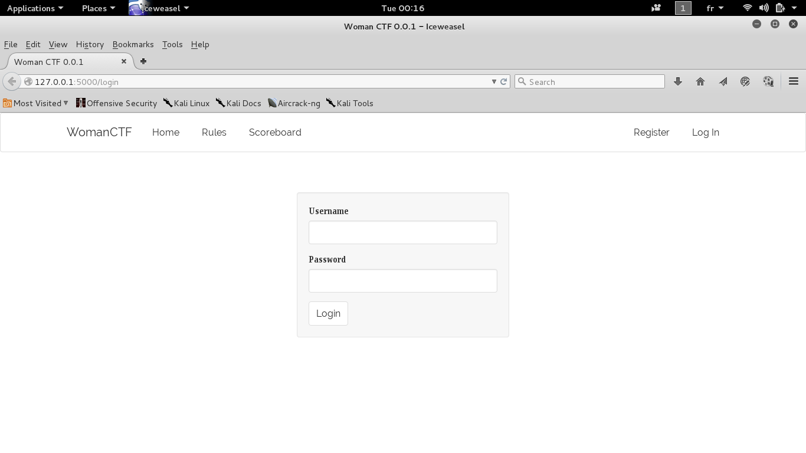
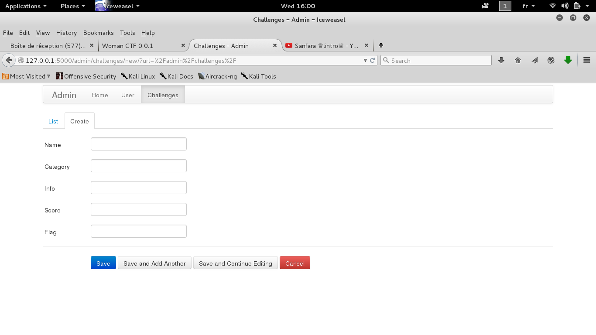
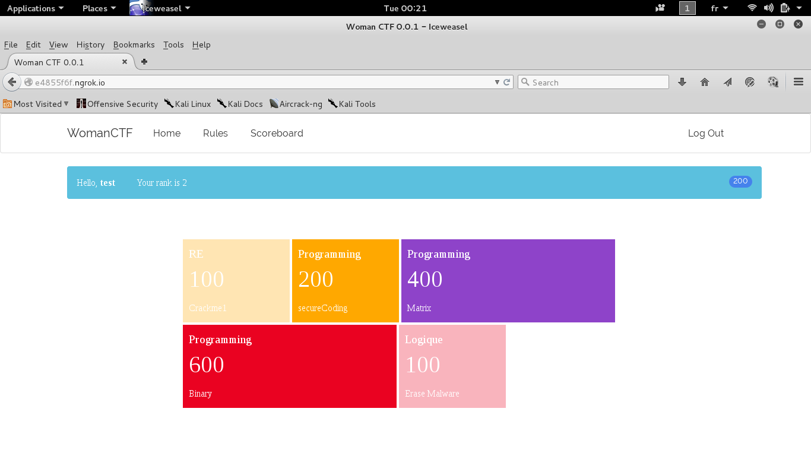

# CTF

The CTF is a Hacking and Computer Security eLearning platform.

### Install requirements
```
pip install -r requirements.txt
```
### Setup email credentials and recaptcha API key
```
export APP_MAIL_USERNAME="<your email>"
export APP_MAIL_PASSWORD="<your password"
export RECAPTCHA_PRIVATE_KEY='<your recaptcha private key>'
export RECAPTCHA_PUBLIC_KEY='< your recaptcha public key>'
```
### Register and login
The register interface allow user to register to the application. It will sent a link to activate the account and verify if the user is human or not with google recaptcha.

When the user is registred and his account is verified he can access the web application.

### Admin interface
Register and login with the user "test" to be able to access the admin interface.
http://127.0.0.1:5000/admin . You will be able to manage users and challenges.


### Challenges
The index interface contain the challenges added by the "test" user.


### Deployment with tornado web server
Tornado is an open source version of the scalable, non-blocking web server and tools that power FriendFeed. Because it is non-blocking and uses epoll, it can handle thousands of simultaneous standing connections, which means it is ideal for real-time web services.
```
pip install tornado
python run.py
```
